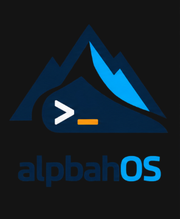

# alpbahOS

Windows'tan geçenler için kolay, Türkçe, kişiselleştirilebilir ve kaynak kullanımına dikkat eden LFS tabanlı x86_64 masaüstü projesi.

**Durum:** M1 temel sistem tamamlandı. LFS 12.4-systemd tabanı BIOS/UEFI emülasyonunda ve Hyper-V Gen2 üzerinde gerçek kernel, giriş istemi, DHCP ağı ve kontrollü yeniden başlatmayla doğrulandı. Grafik masaüstü, canlı ISO ve Hyper-V Gen1 testi sonraki aşamalardadır.

Özel kaynak deposu: [Yoursel71/alpbahOS](https://github.com/Yoursel71/alpbahOS).

## Belgeler

- [Ana plan](docs/MASTER_PLAN.md)
- [Kullanıcı kararları ve teknik seçimler](docs/DECISIONS.md)
- [Görev sırası ve sahiplik](docs/BACKLOG.md)
- [Hyper-V ortam planı](docs/HYPERV_PLAN.md)
- [Ortak ajan kuralları](AGENTS.md)
- [Claude talimatları](CLAUDE.md) ve [ilk görev](docs/CLAUDE_START.md)
- [İş kaydı](docs/WORKLOG.md)
- [M01 önyükleme doğrulaması](docs/M1_BOOT_VERIFICATION.md)
- [Tasarım referansı](docs/alpbahOS-design-mockups.md)

Başlangıç seçimleri: LFS/BLFS, KDE Plasma/KWin, Konsole/Zsh, `alp` paket motoru, grafik mağaza, Solid/Glass profilleri, Atatürk masaüstü/kilit ekranı, Türkçe Q. Steam/Wine için 32-bit kullanıcı alanı uyumluluğu toolchain aşamasında planlanır.

Önce Hyper-V masaüstü ve Legacy+UEFI canlı ISO; sonra Calamares ile grafik/offline/Windows yanında kurulum. Düşük RAM bütçesi ve sürücü uyumluluğu test kapılarıdır.

Kaynak ve belgeler Git'te; ISO, VHDX, rootfs ve build cache'i yerelde tutulur. Bulut build/depolama kullanılmaz. Üçüncü taraf bileşenler kendi lisanslarını korur; proje özgün kodunun yayın lisansı genel dağıtım öncesinde belirlenecek.
