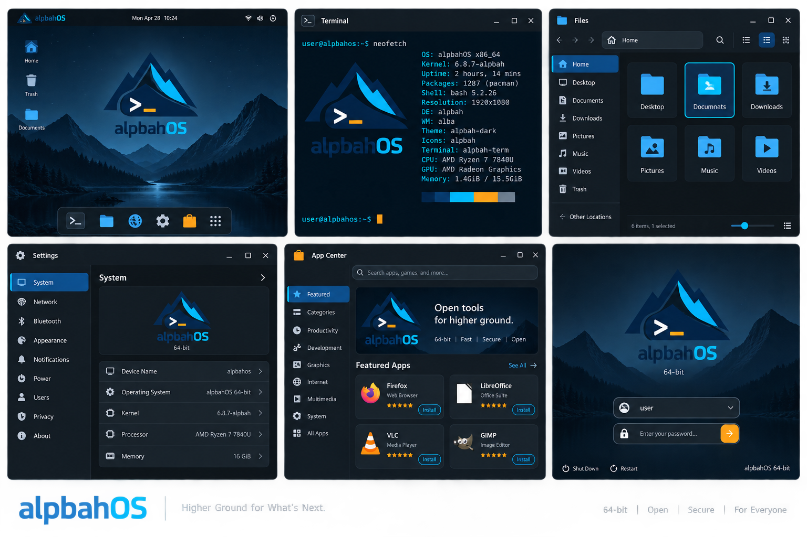

# alpbahOS Tasarım Mockup Spesifikasyonu

**Sürüm:** 0.1<br>
**Tarih:** 21 Eylül 2026<br>
**Platform:** alpbahOS 64-bit<br>
**Durum:** Konsept tasarım / uygulama öncesi tasarım sistemi

> 21 Eylül 2026 güncellemesi: Güncel ürün kararları [ana plandadır](MASTER_PLAN.md). Mevcut ekran yerleşimleri korunur; varsayılan tema premium minimalist `alpbah-solid`, masaüstü/kilit arka planı Atatürk, dil Türkçe ve klavye Türkçe Q'dur. Glass/Liquid seçenek olarak kalır. Bu belgede geçen kernel, paket sayısı ve sistem bilgileri mockup örnekleridir; uygulanmış sistem bilgisi değildir. Terminal logo/ANSI varlıkları üretim öncesi gerçek terminalde yeniden doğrulanacaktır.

## 1. Tasarım özeti

### Kabul edilen yerleşim referansı



Bu görsel yerleşim ve renk referansıdır. Metinleri, donanım bilgileri ve uygulama yetenekleri uygulama sırasında gerçek sistem bilgileriyle değiştirilir. Varsayılan Atatürk arka planı ve Türkçe arayüz kararı ana plandadır.

alpbahOS; dağ silüeti, terminal imgesi ve `alpbahOS` kelime işaretini merkeze alan, koyu temalı ve teknik bir Linux masaüstü deneyimidir.

Tasarımın ana hedefleri:

- İlk bakışta Linux ve geliştirici odaklı bir sistem hissi vermek.
- Masaüstü, terminal ve sistem uygulamalarında aynı görsel dili korumak.
- Koyu yüzeyleri elektrik mavisi ve kontrollü turuncu vurgularla okunabilir hale getirmek.
- Arayüzü gösterişli ama günlük kullanımda sade ve hızlı tutmak.
- 64-bit ürün kimliğini teknik bir detay olarak göstermek, arayüzü bununla doldurmamak.

Ana marka fikri:

> **alpbahOS — Higher Ground for What’s Next.**

Bu slogan mockuplarda yardımcı metin olarak kullanılabilir; ürün arayüzünde zorunlu değildir.

## 2. Logo ve marka kullanımı

### 2.0 Referans logo


Kaynak görsel: [alpbahOS-logo.png](assets/alpbahOS-logo.png)

### 2.1 Logo yapısı

Logo üç ana parçadan oluşur:

1. Koyu lacivert dağ silüeti.
2. Elektrik mavisi zirve/ışık formu.
3. Terminal komutu işareti ve turuncu imleç çizgisi.

Kelime işareti `alpbahOS` biçiminde, küçük harfli marka adı ve büyük `OS` son ekiyle kullanılmalıdır.

### 2.2 Logo varyantları

| Varyant | Kullanım alanı |
|---|---|
| Tam renkli logo | Masaüstü duvar kâğıdı, giriş ekranı, App Center banner’ı |
| Tek renk açık logo | Koyu arka planlarda küçük boyut |
| Sembol-only logo | Dock, pencere başlığı, sistem tepsisi, favicon |
| 64-bit rozetli logo | Sistem bilgileri, yükleyici ve About ekranı |

### 2.3 Koruma alanı

Logo çevresinde, sembol yüksekliğinin en az `0.25x` değeri kadar boşluk bırakılmalıdır. Logo; pencere kenarına, butona veya başka bir ikona yapıştırılmamalıdır.

### 2.4 Kaçınılacak kullanımlar

- Dağ formunu yatay olarak sıkıştırmak.
- Elektrik mavisini mor veya yeşile çevirmek.
- Terminal imgesini kaldırıp marka oranlarını bozmak.
- Logoya gölge, parlama veya ağır 3D efekt eklemek.
- `alpbahos`, `AlpbahOS` veya `ALPBAHOS` biçimlerini ana marka adı olarak kullanmak.

### 2.5 Neofetch ASCII logosu

Neofetch gibi terminal bilgi araçlarında kullanılabilecek sade ASCII karşılığı:

```text
                 ${c1}                 /\\
                 ${c1}                /  \\
                 ${c1}       /\\      /    \\       /\\
                 ${c1}      /  \\    /      \\     /  \\
                 ${c1}  /\\ /    \\__/        \\___/    \\
                 ${c1} /  V                    ${c2}\\      \\
                 ${c1}/        ${c4}                    ${c2}\\      \\
                 ${c1}\\      ${c4}       ${c2} /\\              \\
                 ${c1} \\____${c4}      ${c2} /  \\____          /
                 ${c1}      \\____${c2}/        \\________/
                 ${c1}          ${c2}\\          /
                 ${c1}           \\________/
                 ${c1}          .-========-.
                 ${c1}         /  ${c2}>_      ${c1}\\
                 ${c1}        /      ${c3}__    ${c1}\\
                 ${c1}        \\____${c3}/  \\__${c1}/
                 ${c1}             ${c3}\\__/

                 ${c1}        a l p b a h ${c2}O${c2}S
                 ${c4}        6 4 - b i t  •  L i n u x
```

Neofetch yapılandırmasında renk değişkenleri şu şekilde önerilir:

```bash
# ~/.config/neofetch/config.conf
ascii_distro=""
ascii_bold="on"
colors=(4 6 7 3 4 6)
```

Renk eşlemesi:

- `${c1}`: koyu lacivert / dağ silüeti.
- `${c2}`: elektrik mavisi / terminal ve `OS`.
- `${c3}`: turuncu / imleç ve küçük vurgu.
- `${c4}`: açık cyan veya beyaz / marka alt bilgisi ve ışık katmanı.

ASCII logo, dar terminal pencerelerinde kırpılmaması için 24 karakteri aşmayacak şekilde tasarlanmıştır. Daha iyi sonuç için terminal fontu monospace ve pencere genişliği en az 80 sütun olmalıdır.

### 2.6 Gerçek logo üzerinden üretilen renkli ASCII

Elle çizilmiş fallback sürümüne ek olarak, gerçek alpbahOS PNG logosunu piksellerinden okuyup ANSI truecolor half-block karakterlerine dönüştüren Python aracı da bulunmaktadır.

Dosyalar:

- [Üretici Python aracı](assets/generate_neofetch_ascii.py)
- [Renkli ANSI logo çıktısı](assets/alpbahOS-neofetch-ansi.txt)
- [ASCII terminal önizlemesi](assets/alpbahOS-neofetch-preview.png)

Üretmek için:

```bash
python assets/generate_neofetch_ascii.py \
  assets/alpbahOS-logo.png \
  assets/alpbahOS-neofetch-ansi.txt \
  --width 48
```

Terminalde görüntülemek için:

```bash
cat assets/alpbahOS-neofetch-ansi.txt
```

Bu sürüm, logo görselindeki dağ silüetini, cyan zirveyi, terminal sembolünü, turuncu imleci ve `alpbahOS` yazısını renkleriyle birlikte korur. `--width 48` normal terminal kullanımı için, `--width 64` daha geniş ekranlar için önerilir.

## 3. Görsel dil

### 3.1 Renk token’ları

```css
:root {
  --ab-bg-950: #0b1014;
  --ab-bg-900: #11171c;
  --ab-surface-800: #16232d;
  --ab-surface-700: #1d2c38;
  --ab-border: #29404f;

  --ab-navy: #062746;
  --ab-navy-strong: #031a31;
  --ab-cyan: #00aeef;
  --ab-cyan-soft: #54d6ff;
  --ab-orange: #f5a623;
  --ab-orange-soft: #ffc45d;

  --ab-text-strong: #f4f8fb;
  --ab-text: #d4e0e8;
  --ab-text-muted: #8ea2af;
  --ab-text-disabled: #53636d;

  --ab-success: #35d07f;
  --ab-warning: #f5a623;
  --ab-danger: #ff6575;
  --ab-info: #4fc9ff;
}
```

Renk kullanım oranı:

- `%60` grafit/koyu arka plan.
- `%25` lacivert yüzeyler.
- `%10` elektrik mavisi.
- `%5` turuncu vurgu.

Turuncu yalnızca aktif imleç, birincil eylem, uyarı veya dikkat çekmesi gereken küçük noktalar için kullanılmalıdır.

### 3.2 Tipografi

- Birincil font: **Inter** veya sistemdeki eşdeğer sans-serif.
- Terminal fontu: **JetBrains Mono** veya **Cascadia Code**.
- Başlık ağırlıkları: 600–700.
- Gövde metni: 400–500.
- Teknik değerler: monospace, 400–600.

Önerilen ölçüler:

| Token | Boyut | Kullanım |
|---|---:|---|
| `display` | 32 px | Giriş ekranı veya büyük banner |
| `title` | 22 px | Uygulama başlığı |
| `heading` | 16 px | Bölüm başlığı |
| `body` | 14 px | Standart metin |
| `label` | 12 px | Yardımcı bilgi, rozet |
| `caption` | 11 px | İkincil bilgi |
| `terminal` | 14 px | Terminal satırları |

### 3.3 Şekil ve boşluklar

- Genel köşe yarıçapı: `10 px`.
- Kart köşesi: `12 px`.
- Büyük modal köşesi: `16 px`.
- Küçük rozet ve durum noktası: `999 px`.
- Temel aralık birimi: `4 px`.
- Standart iç boşluk: `16 px`.
- Büyük panel iç boşluğu: `24 px`.

Yüzeyler birbirinden yalnızca çizgiyle değil, ton farkıyla da ayrılmalıdır. İnce `1 px` cyan border yalnızca seçili veya odaklanmış bileşenlerde kullanılmalıdır.

## 4. Genel sistem teması

### 4.1 Masaüstü düzeni

Masaüstü; üst panel, sol tarafta temel sistem ikonları ve alt/merkez dock yapısından oluşur.

Üst panel:

- Sol: küçük alpbahOS sembolü ve aktif uygulama adı.
- Orta: tarih ve saat.
- Sağ: ağ, ses, pil/güç ve hızlı ayarlar.
- Panel yüksekliği: `32–36 px`.
- Arka plan: yarı saydam `--ab-bg-950`.

Masaüstü:

- Koyu dağ ve göl temalı duvar kâğıdı.
- Duvar kâğıdında logo büyük ama düşük kontrastlı kullanılabilir.
- Masaüstü ikonları sade, cyan çizgili ve etiketleri açık gri olmalıdır.

Dock:

- Ortalanmış veya kullanıcının seçimine göre sola yaslı olabilir.
- Terminal, Dosyalar, Web, Ayarlar, App Center ve uygulama menüsü ikonları.
- Aktif uygulama altında küçük cyan çizgi.
- App Center için turuncu çanta sembolü.

### 4.2 Pencere davranışı

- Başlık çubuğu koyu lacivert/siyah yüzey.
- Pencere kontrol ikonları sağ üstte.
- Aktif pencere border’ı `--ab-cyan` ile 1 px.
- Pasif pencere border’ı `--ab-border`.
- Pencereler hafif gölgeli; ağır blur ve aşırı cam efekti kullanılmamalı.

### 4.3 Sistem menüsü

Hızlı sistem menüsü şu grupları içermelidir:

- Wi-Fi / Ethernet.
- Ses seviyesi.
- Ekran parlaklığı.
- Gece ışığı.
- Bluetooth.
- Güç ve oturum seçenekleri.

Menü kartları `--ab-surface-800` üzerinde görünür. Seçili durum cyan, dikkat durumu turuncudur.

## 5. Mockup 01 — Masaüstü ana ekranı

### Amaç

Kullanıcının sisteme giriş yaptıktan sonra gördüğü ana çalışma alanını tanımlamak.

### Kompozisyon

- 16:9 ekran.
- Duvar kâğıdı: gece dağları, göl ve hafif mavi gökyüzü.
- Orta/sağ alanda hafif büyük alpbahOS sembolü.
- Sol üstte `Home`, `Trash`, `Documents` ikonları.
- Alt merkezde dock.

### İçerik

- Üst panelde `Mon Apr 28 10:24` biçiminde saat gösterimi.
- Dock sırası: Terminal, Files, Browser, Settings, App Center, Applications.
- Aktif uygulama için cyan alt çizgi.
- Sağ üstte bağlantı ve ses ikonları.

### Etkileşim

- Dock ikonu üzerine gelince küçük tooltip.
- Uygulama açılırken ikon kısa süreli turuncu vurgu alır.
- Sağ üst sistem alanına tıklanınca hızlı ayarlar paneli açılır.
- Masaüstüne sağ tıklanınca `Yeni klasör`, `Duvar kâğıdını değiştir`, `Ekran ayarları` seçenekleri gösterilir.

### Kabul kriterleri

- Logo duvar kâğıdında okunabilir ama çalışma alanını kaplamaz.
- Dock açık ve koyu duvar kâğıtlarında görünür.
- Masaüstü ikonları seçiliyken cyan, silme gibi kritik eylemlerde orange uyarı verir.

## 6. Mockup 02 — Terminal

### Amaç

Geliştirici ve ileri seviye kullanıcıların temel çalışma alanını göstermek.

### Kompozisyon

- Koyu lacivert/siyah terminal yüzeyi.
- Sol üstte terminal sembolü ve `Terminal` başlığı.
- Üstte standart pencere kontrol düğmeleri.
- Terminal içinde monospace metin.

### Örnek içerik

```text
user@alpbahos:~$ neofetch

OS:       alpbahOS x86_64
Kernel:   6.8.7-alpbah
Uptime:   2 hours, 14 mins
Packages: 1287 (pacman)
Shell:    bash 5.2.26
DE:       alpbah
WM:       alba
Theme:    alpbah-dark

user@alpbahos:~$ _
```

### Renkler

- Prompt kullanıcı adı: cyan.
- Komut satırı: açık gri.
- Başarılı çıktı: cyan veya yeşil.
- Uyarı: turuncu.
- Hata: kırmızı.
- İmleç: turuncu dikdörtgen.

### Etkileşim

- Sekmeler ayrı cyan çizgiyle ayrılır.
- Aktif sekme cyan, pasif sekme muted text.
- Arama ve kopyalama araçları başlık çubuğunda bulunabilir.
- Terminal seçimi sistem vurgusunu kullanır; metin rengi koyu lacivert olabilir.

## 7. Mockup 03 — Dosyalar

### Amaç

Dosya yönetimini günlük kullanıcı için sade ve güçlü hale getirmek.

### Kompozisyon

- Sol navigasyon sütunu.
- Üstte geri/ileri, konum alanı ve arama.
- Sağda görünüm değiştirme ikonları.
- Orta alanda büyük klasör kartları.

### Navigasyon

- Home
- Desktop
- Documents
- Downloads
- Pictures
- Music
- Videos
- Trash
- Other Locations

### Görsel davranış

- Klasör ikonları cyan/mavi.
- Seçili klasör cyan border ve koyu mavi arka plan.
- Silme ve çöp kutusu eylemleri turuncu veya kırmızı durum rengiyle gösterilir.
- Dosya önizlemeleri sade, kart yüzeyleri `--ab-surface-800`.

### Etkileşim

- Tek tıklama seçim, çift tıklama açma.
- Sürükleyip bırakmada hedef klasör cyan parlamayla işaretlenir.
- Büyük dosya kopyalamada alt bilgi alanında progress bar.
- Koyu arayüzde ikonlar yeterli kontrasta sahip olmalıdır.

## 8. Mockup 04 — Ayarlar / Control Center

### Amaç

Sistemin kişiselleştirme ve yönetim ekranlarını tek bir tutarlı yapıda sunmak.

### Sol menü

- System
- Network
- Bluetooth
- Appearance
- Notifications
- Power
- Users
- Privacy
- About

### System ekranı

Ana kartlarda:

- Cihaz adı: `alpbahos`.
- İşletim sistemi: `alpbahOS 64-bit`.
- Kernel sürümü.
- CPU bilgisi.
- Bellek kapasitesi.
- Grafik işlemcisi.

### Appearance ekranı

Kontroller:

- Açık/koyu tema, varsayılan koyu.
- Cyan vurgu yoğunluğu.
- Turuncu vurgu kullanımı.
- Dock konumu.
- Duvar kâğıdı.
- Pencere yuvarlaklığı.
- Animasyonları azalt.

### Etkileşim

- Sol menüde aktif öğe cyan border ile belirtilir.
- Değişiklikler mümkünse anında önizlenir.
- Riskli sistem değişikliklerinde açıklayıcı onay modalı kullanılır.

## 9. Mockup 05 — App Center

### Amaç

Uygulama keşfi, kurulumu ve güncellemelerini marka diliyle birleştirmek.

### Kompozisyon

- Sol kategori menüsü.
- Üstte geniş arama alanı.
- Öne çıkan uygulamalar için alpbahOS banner’ı.
- Alt bölümde uygulama kartları.

### Kategoriler

- Featured
- Categories
- Productivity
- Development
- Graphics
- Internet
- Multimedia
- System
- All Apps

### Uygulama kartı

Her kart şunları içerir:

- Uygulama ikonu.
- Uygulama adı.
- Kısa açıklama.
- Puan.
- Boyut veya kaynak bilgisi.
- `Install`, `Update` veya `Open` butonu.

### Renk davranışı

- Install: cyan border veya cyan dolgu.
- Update: turuncu vurgu.
- Open: yeşil veya cyan.
- Güvenlik uyarısı: turuncu ikon ve açıklama.

### Öne çıkan banner

Banner’da logo ve şu tür bir mesaj kullanılabilir:

> Open tools for higher ground.

Alt bilgi: `64-bit · Fast · Secure · Open`.

## 10. Mockup 06 — Giriş ve açılış ekranı

### Amaç

Sistemin ilk saniyesinde güçlü ve sakin bir marka deneyimi oluşturmak.

### Kompozisyon

- Tam ekran dağ/göl duvar kâğıdı.
- Ortada alpbahOS tam logosu.
- Logo altında `64-bit` bilgisi.
- Kullanıcı seçim alanı.
- Şifre alanı ve turuncu ok butonu.
- Alt bölümde `Shut Down` ve `Restart` seçenekleri.

### Etkileşim

- Şifre alanına odaklanınca cyan border.
- Giriş gönderme butonu turuncu.
- Hatalı girişte kısa kırmızı uyarı ve açıklayıcı metin.
- Başarılı girişte logo hafif küçülerek masaüstüne geçiş yapılır.

## 11. Ortak bileşen kütüphanesi

### Butonlar

| Tür | Görünüm | Kullanım |
|---|---|---|
| Primary | Cyan dolgu, koyu metin | Kur, Kaydet, Aç |
| Secondary | Koyu yüzey, cyan border | İkincil işlem |
| Accent | Turuncu dolgu | Giriş, önemli eylem |
| Ghost | Arka plansız | İptal, yardımcı eylem |
| Danger | Kırmızı vurgu | Silme, geri dönüşsüz işlem |

### Form alanları

- Normal: `--ab-surface-700` arka plan, `--ab-border` çizgi.
- Odak: cyan border ve hafif cyan glow.
- Hatalı: danger border ve alan altı açıklaması.
- Devre dışı: düşük kontrast, metin açıklaması korunur.

### Bildirimler

- Başarı: yeşil nokta/ikon.
- Bilgi: cyan.
- Uyarı: turuncu.
- Hata: kırmızı.

Bildirimler ekranda uzun süre kalmamalı; önemli uyarılar kalıcı ve kapatılabilir olmalıdır.

## 12. Responsive ve ölçekleme

### Masaüstü

- Minimum hedef: `1280 × 720`.
- Önerilen: `1920 × 1080`.
- Yüksek yoğunluk: 2x ekranlarda ikon ve metinler bulanıklaşmamalı.

### Küçük ekran

- Sol menüler daraltılabilir.
- Dock ikonları küçülür fakat dokunma hedefi `40 px` altına inmez.
- App Center kartları tek sütuna düşer.
- Dosyalar görünümü liste moduna geçebilir.

### Erişilebilirlik

- Normal metin için en az WCAG AA kontrastı.
- Durumlar yalnızca renkle anlatılmamalı; ikon veya metin eklenmeli.
- Klavye odağı her zaman görünür olmalı.
- Animasyon azaltma ayarı desteklenmeli.
- Terminal ve dosya yönetimi tamamen klavye ile kullanılabilmeli.

## 13. Animasyon prensipleri

- Pencere açılışı: `120–160 ms`, ease-out.
- Menü açılışı: `100–140 ms`.
- Dock hover: `100 ms`.
- App Center yükleme durumu: yumuşak progress animasyonu.
- Giriş ekranından masaüstüne geçiş: `250–350 ms`.

Animasyonlar arayüzü anlatmalı; dikkat dağıtacak sürekli parlamalar ve döngüler kullanılmamalıdır.

## 14. Duvar kâğıdı yönü

Ana duvar kâğıdı:

- Gece dağları ve göl.
- Lacivert ağırlıklı tonlar.
- Dağ zirvesinde cyan ışık.
- Ufukta çok az turuncu sıcaklık.
- Merkezde ikonların arkasında düşük detaylı boş alan.

Alternatifler:

1. Sade koyu lacivert degrade.
2. Geometrik dağ çizgileri.
3. Terminal karakterleriyle oluşturulmuş soyut dağ.
4. Yüksek kontrastlı erişilebilir duvar kâğıdı.

## 15. Uygulama teması yönergeleri

Her alpbahOS uygulaması şu ortak kuralları izlemelidir:

- Başlık çubuğu ve pencere kontrolü ortak olmalı.
- Arama alanı, sekme, buton ve bildirim stilleri aynı token’lardan gelmeli.
- Uygulama ikonu cyan/mavi tabanlı, turuncu küçük detaylı olabilir.
- Her uygulamanın kendine özgü rengi varsa, vurgu rengi alpbahOS cyan’ını tamamen bastırmamalıdır.
- Sistem ayarları ve uygulama mağazası daha fazla cyan kullanabilir; terminal daha sade kalmalıdır.

Önerilen uygulama tema adları:

- `alpbah-dark` — varsayılan koyu tema.
- `alpbah-midnight` — daha koyu ve düşük parlaklıklı tema.
- `alpbah-contrast` — yüksek kontrastlı erişilebilir tema.
- `alpbah-light` — ileride eklenecek açık tema; lacivert metin, açık gri yüzey ve cyan vurgu.

## 16. Teknik uygulama notları

- Renk ve boşluk token’ları tek bir merkezi tema dosyasından yönetilmelidir.
- Sistem ikonları SVG veya eşdeğer ölçeklenebilir formatta tutulmalıdır.
- Logo raster olarak değil, üretim aşamasında vektör tabanlı kaynakla kullanılmalıdır.
- App Center ve Settings bileşenleri ortak bir UI kütüphanesinden beslenmelidir.
- Pencere teması, uygulamaların kendi stilinden önce sistem token’larını yüklemelidir.
- Terminal renkleri ANSI renk paletiyle uyumlu hale getirilmelidir.
- Koyu temada gölge yerine yüzey tonu farkı tercih edilmelidir.

## 17. Tasarım teslim listesi

Üretim öncesi hazırlanacak dosyalar:

- Logo SVG: tam renk, tek renk, sembol-only.
- Logo PNG: 16, 24, 32, 48, 64, 128, 256, 512 px.
- App Center banner’ı.
- Giriş ekranı arka planı.
- Varsayılan masaüstü duvar kâğıdı.
- Sistem ikon seti.
- Uygulama ikon şablonu.
- Renk ve tipografi token dosyası.
- Masaüstü mockup’ı.
- Terminal mockup’ı.
- Dosyalar mockup’ı.
- Ayarlar mockup’ı.
- App Center mockup’ı.
- Giriş ekranı mockup’ı.

## 18. Son kabul kriterleri

Tasarım seti tamamlandığında:

- Tüm ekranlar ilk bakışta aynı alpbahOS ürününe ait görünmelidir.
- `alpbahOS` kelime işareti her yerde doğru yazılmalıdır.
- Cyan ve turuncu vurgu renklerinin görevleri karıştırılmamalıdır.
- Terminal, Dosyalar, Ayarlar ve App Center arasında ortak bileşen davranışı korunmalıdır.
- 64-bit bilgisi görünür fakat baskın olmayan bir detay olmalıdır.
- Koyu tema hem estetik hem de okunabilir olmalıdır.
- Klavye odağı, kontrast, hata mesajları ve renk dışı durum işaretleri uygulanmalıdır.
- Mockuplar gerçek uygulama bileşenlerine dönüştürülebilecek kadar açık ölçü ve davranış bilgisi içermelidir.

---

## Kısa karar özeti

alpbahOS’un varsayılan görsel kimliği; **koyu grafit yüzey + lacivert dağ + elektrik mavisi vurgu + küçük turuncu etkileşim işareti** üzerine kurulmalıdır. Masaüstü, terminal, Dosyalar, Ayarlar, App Center ve giriş ekranı aynı tasarım token’larını kullanmalı; farklılaşma yalnızca uygulamanın işlevinden gelmelidir.
